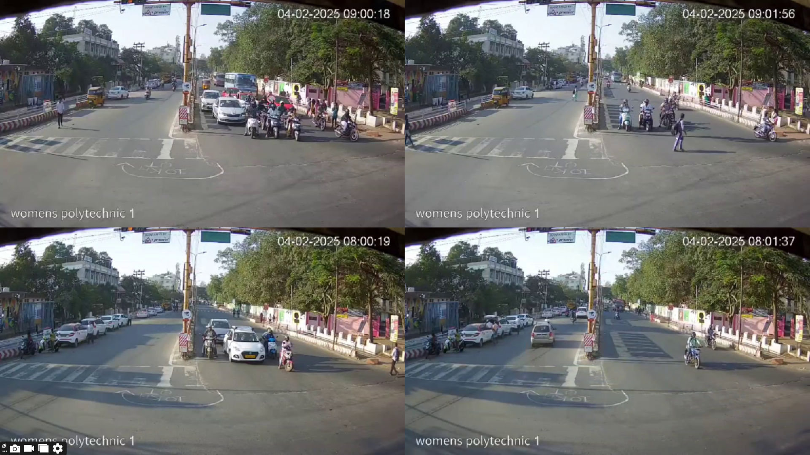

# AI-Based Smart Traffic Management System with Emergency Vehicle Prioritization

---

##  **Problem Statement**

Current traffic signal systems operate on fixed time intervals without adapting to real-time traffic conditions. They:

- **Cause unnecessary delays** for road users during low traffic periods.
- **Fail to prioritize emergency vehicles** like ambulances and fire trucks, leading to delayed response times and potential loss of life.

This lack of dynamic control leads to **inefficient traffic flow**, **long wait times**, and **life-threatening delays** for emergency services.

---

##  **Proposed AI Solution**

We designed an AI-based traffic management system that:

- Uses **YOLO (You Only Look Once)** object detection to analyze live traffic footage.
- Dynamically adjusts **green/red light timings** based on **real-time vehicle density** in each lane.
- Detects **emergency vehicles** (ambulances, fire engines) and overrides normal signal sequences to **prioritize their lane**, even if it’s not their turn.
- Integrates **IoT devices** (ESP32-CAM and radar modules) to monitor proximity and verify the movement of emergency vehicles.

---

##  **Technology Stack**

- **Computer Vision**: YOLOv8, OpenCV  
- **Hardware**: ESP32-CAM, BeagleBone Black  
- **IoT Integration**: Distance sensor (Free-Fi meter), radio-wave-based emergency detection  
- **Programming**: Python, Embedded C  
- **Data**: Real footage from Coimbatore city under various weather and lighting conditions

---
## **output video not disclosed due secuirty reasons so i have only uploaded a image**

##  **Achievements**

-  **First Prize in IDEATHON and PROJECT EXPO** at **SNS College of Technology**
-  **Proof of Concept Approved** by the **Commissioner of Police, Coimbatore**
-  **Selected by MSME Innovation Cell** for **Pilot Testing**

---

## **Project Timeline & Milestones**

| Stage              | Description                                                                 |
|--------------------|-----------------------------------------------------------------------------|
| SIH Rejection    | Initially submitted to Smart India Hackathon but rejected due to political reasons |
|  Real-World Data  | Acquired rear-view footage → trained model → lacked emergency vehicle clarity |
|  Front View Footage | Reached out again → received proper footage from police → retrained YOLO model |
|  IoT Integration  | Used 2 ESP32-CAM modules and Free-Fi meters near signals to detect & prioritize emergency vehicles |
|  Pilot Testing    | Currently under real-environment pilot testing in partnership with local authorities |

---

##  **Impact**

This system:

- Reduces **average waiting time** for vehicles during traffic.
- Helps **ambulances reach hospitals up to 40% faster**.
- Demonstrates how **AI + IoT can modernize public infrastructure** for safety and efficiency.

---
